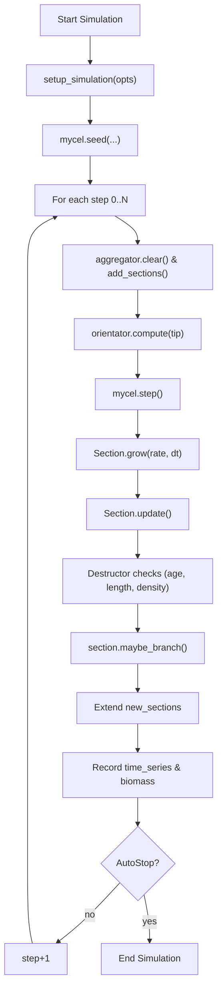

# Pycelium

A 3D simulation of fungal mycelium growth with support for GUI launching, CLI batch runs, and parameter sweeps. Includes nutrient attraction, density sensitivity, branching control, and anisotropy.

---

## Features

- 🌱 Realistic 3D mycelium growth simulation
- 📊 Batch mode with parameter sweeping
- 🖥️ GUI interface for live parameter tweaking
- 🧪 CLI + JSON-based batch config
- 🔁 Parallel batch processing with auto-scaling
- 🎥 Visualisation & animation outputs (2D, 3D, video)
- 🧬 RGB and Phenotype mutation logic

---

## Installation

### Clone the repo

```bash
git clone https://github.com/ETancredi/python_nsm.git
cd python_nsm/python_wd/python_nsm/hyphal_growth_model
```

### Set up a virtual environment (recommended)

```bash
python3 -m venv venv
source venv/bin/activate  # On Windows: venv\Scripts\activate
```

### Install dependencies

```bash
pip install -r requirements.txt
```

---

## Dependencies

You can install manually with:

```bash
pip install matplotlib numpy scipy pandas plotly opencv-python
```

---

## Running the Simulator

### Launch GUI Mode

```bash
python3 -m launcher.run --mode gui
```

### Run from Command Line

```bash
python3 -m launcher.run --mode cli --config config/param_config.json
```

### Run Batch (Sequential)

```bash
python3 experiments/batch_runner.py
```

### Run Batch (Parallel)

In `batch_runner.py`, uncomment:

```python
# run_batch_parallel(config_path)
```

and comment out:

```python
run_batch(config_path)
```

Then run:

```bash
python3 experiments/batch_runner.py
```

---

## Running Parameter Sweeps

Edit `config/batch_config.json` with multiple `runs`. Example:

```json
{
  "runs": [
    {
      "name": "low_branching",
      "options": {
        "branch_probability": 0.2
      },
      "steps": 100
    },
    {
      "name": "high_branching",
      "options": {
        "branch_probability": 0.8
      },
      "steps": 100
    }
  ]
}
```
---

## Runtime Workflow


---

## Output Files

Each simulation produces a variety of artifacts saved in the `outputs/` or `batch_outputs/` folder, depending on single/batch simulation run:

- `mycelium_2d.png` – 2D projection of mycelium growth
- `mycelium_3d.png` – Static 3D view of mycelium
- `mycelium_3d_interactive.html` – Interactive 3D visualisation (Plotly)
- `mycelium_growth.mp4` – MP4 animation of growth over time
- `mycelium.csv` – Final state of each section
- `mycelium_final.csv` – Section data for final state
- `mycelium_time_step.csv` – All tips by time step
- `mycelium_time_series.csv` – Time series of tip positions
- `mycelium.obj` – 3D model export (OBJ format)
- `density_map.csv` – Raw density values
- `density_map.png` – Visualised density map
- `branching_angles.csv` / `.png` – Branching angle stats & plot
- `orientations.csv` / `tip_orientations.png` – Final tip direction analysis
- `stats.png` – Summary plots of growth & activity
- `checkpoints/` – JSON saves of simulation state (periodic)

---

## Authorship

Developed by Edoardo Tancredi and Contributors:

Michael J. Bottery, Michael J. Bromley, Christopher G. Knight, Ian Hall

Original model based on the Neighbour-Sensing Model of Hyphal Growth doi.org/10.1017/S0953756204001261

Based on work by: Audris Meškaukas, Mark D. Fricker, Liam J McNulty, and David Moore

---

## License

MIT License
