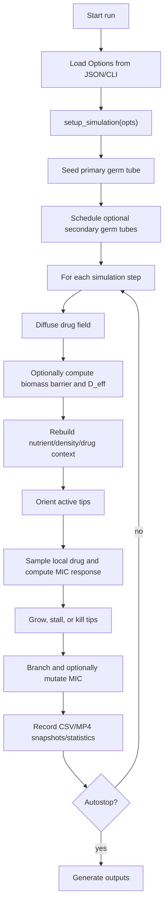

# Pycelium

Pycelium is a Python simulation framework for fungal hyphal-network growth. It began as a neighbour-sensing mycelium model and now includes 2D/3D growth, branching, density effects, tropisms, delayed germ-tube emergence, antifungal diffusion, MIC-dependent growth inhibition, MIC mutation, mutant-lineage visualisation, fungistatic/fungicidal drug logic, and biofilm-like hindrance of drug penetration through dense hyphal biomass.

The current working model is especially aimed at exploring how *Aspergillus*-like hyphal colonies interact with spatial antifungal gradients, how resistant mutant lineages emerge, and how dense internal colony structure can alter drug access to the colony interior.

---

## Key features

### Core hyphal growth

- 2D or 3D mycelial growth.
- Branching, tip ageing, density-dependent pruning, tropisms, anisotropy, nutrient fields, and volume constraints.
- CLI, GUI, and batch/sweep workflows.
- Reproducible runs through a configurable random seed.

### Delayed secondary germ tubes

Pycelium can now model conidia that begin with one primary germ tube and then, after a configurable lag, produce one or more additional germ tubes from the original spore position. This is controlled by the `secondary_germ_tubes_*` parameters.

Useful parameters:

```json
"secondary_germ_tubes_enabled": true,
"secondary_germ_tube_min_step": 2,
"secondary_germ_tube_max_step": 10,
"secondary_germ_tube_min_count": 1,
"secondary_germ_tube_max_count": 4,
"secondary_germ_tube_angle_degrees": 180.0,
"secondary_germ_tube_angle_spread": 25.0
```

Relevant CSV metadata includes `germ_tube_order`, `germ_tube_role`, `emergence_step`, and `emergence_time`.

### Antifungal drug field

The model includes a 2D finite-difference antifungal field that diffuses alongside the colony. Tips sample local drug concentration from the field and alter growth accordingly.

Supported initial conditions include:

- `uniform` — one concentration everywhere.
- `vertical_sections` — megaplate-style concentration bands.
- `square_perimeter` — outside-in square-field diffusion from a drug-loaded perimeter.
- `legacy` — backwards-compatible behaviour using the older boolean switches.

Useful parameters:

```json
"drug_field_enabled": true,
"drug_initial_condition": "square_perimeter",
"drug_field_x_min": -100.0,
"drug_field_x_max": 100.0,
"drug_field_y_min": -100.0,
"drug_field_y_max": 100.0,
"drug_field_dx": 1.0,
"drug_diffusion_coefficient": 0.25,
"drug_diffusion_dt": 1.0,
"drug_diffusion_substeps": 1
```

Drug fields can be exported as:

```text
drug_field_initial.npy
drug_field_initial.csv
drug_field_initial.png
drug_field_final.npy
drug_field_final.csv
drug_field_final.png
```

### MIC-centred pharmacodynamic response

The default drug response is MIC-centred rather than a simple half-inhibition multiplier. The signed growth response is:

```text
Ψ = Ψmax - ((Ψmax - Ψmin) * (A / MIC)^k)
           / ((A / MIC)^k - (Ψmin / Ψmax))
```

where:

```text
Ψmax = drug-free growth rate
Ψmin = high-drug asymptotic growth rate
A    = local antifungal concentration
MIC  = tip-specific MIC
k    = Hill/slope coefficient
```

Important interpretation:

```text
A == MIC  ->  Ψ == 0
```

The CSV exports distinguish:

- `drug_raw_growth_rate` — signed pharmacodynamic growth rate, which can be negative.
- `drug_effective_growth_rate` — non-negative rate actually used for extension.
- `drug_growth_multiplier` — applied rate divided by baseline growth rate.

### Fungistatic and fungicidal modes

Drug outcome behaviour is controlled with:

```json
"drug_effect_type": "fungistatic"
```

or:

```json
"drug_effect_type": "fungicidal"
```

Modes:

- `fungistatic` — inhibited tips stall but remain alive.
- `fungicidal` — inhibited tips are killed and lose their live tip marker.
- `legacy` — defer to the older `drug_nonpositive_growth_action` setting.

For fungicidal runs:

```json
"drug_fungicidal_condition": "raw_growth_nonpositive"
```

kills tips when `drug_raw_growth_rate <= 0`, while:

```json
"drug_fungicidal_condition": "concentration_at_or_above_mic"
```

kills tips when local drug concentration is greater than or equal to that tip's MIC.

Additional exported fields include `drug_killed_by_drug` and `drug_death_time`.

### Heritable MIC mutation and breakout lineages

New daughter sections inherit their parent MIC. When MIC mutation is enabled, each new daughter has a configurable baseline probability of mutating.

Mutation effect sizes are multiplicative and Laplace-distributed on the log scale:

```text
delta ~ Laplace(0, drug_mic_mutation_scale)
child_MIC = parent_MIC * exp(delta)
```

This gives many small MIC shifts and exponentially fewer large resistance or susceptibility jumps.

Useful parameters:

```json
"drug_mic_mutations_enabled": true,
"drug_mic_mutation_base_probability": 0.01,
"drug_mic_mutation_scale": 1.0,
"drug_mic_min": 0.05,
"drug_mic_max": 8.0
```

The explicit density-boosted MIC mutation model was removed. Dense internal growth now increases resistance opportunities indirectly by producing more sections/branches, each with the same baseline mutation chance.

### MIC-mutant lineage colours

When `drug_mic_lineage_coloring_enabled` is true, every new MIC-mutant lineage receives a distinct inherited colour. Descendants keep that colour until a later MIC mutation creates a new sub-lineage.

Useful parameters:

```json
"drug_mic_lineage_coloring_enabled": true,
"drug_mic_wildtype_color": [0.1, 0.1, 0.1],
"drug_mic_palette_saturation": 0.8,
"drug_mic_palette_value": 0.95
```

CSV metadata includes:

```text
mic_mutation_lineage_id
mic_mutation_origin_section_id
visual_color_source
r, g, b
```

`mic_mutation_lineage_id = 0` is the wildtype/non-mutant lineage.

### Stalled/dead hypha highlighting

Drug-stalled or drug-killed terminal hyphae can be highlighted visually while retaining the underlying lineage colour.

Useful parameters:

```json
"highlight_zero_growth_hyphae": true,
"zero_growth_highlight_color": [1.0, 0.15, 0.0],
"zero_growth_highlight_linewidth": 2.6,
"zero_growth_highlight_marker_size": 34.0
```

This makes it easy to distinguish:

- actively growing living tips,
- stalled fungistatic tips,
- dead fungicidal tips,
- resistant mutant lineages that continue beyond inhibited regions.

### Biofilm-like hindrance of antifungal diffusion

Dense hyphal biomass can now reduce local antifungal diffusion, representing the way an aspergilloma or dense hyphal biofilm may hinder drug penetration.

The effective diffusion coefficient is:

```text
D_eff = D * [f_min + (1 - f_min) * exp(-strength * biomass_barrier)]
```

Useful parameters:

```json
"drug_diffusion_hindered_by_biomass": true,
"drug_hyphal_barrier_strength": 2.0,
"drug_hyphal_barrier_radius": 3.0,
"drug_hyphal_barrier_length_scale": 20.0,
"drug_hyphal_barrier_min_diffusion_fraction": 0.05,
"drug_hyphal_barrier_include_dead": true
```

When enabled, Pycelium can export:

```text
drug_biomass_barrier_final.npy
drug_biomass_barrier_final.csv
drug_biomass_barrier_final.png
drug_effective_diffusion_final.npy
drug_effective_diffusion_final.csv
drug_effective_diffusion_final.png
```

### Drug-aware visual outputs

Drug visualisation outputs include:

- white-to-dark-blue heatmaps where white is no drug and dark blue is high drug,
- combined mycelium-over-drug overlays,
- upgraded 2D MP4s showing connected hyphal segments, live tips, mutant lineage colours, dead/stalled highlights, and the diffusing drug field through time.

Useful MP4 parameters:

```json
"generate_mycelium_growth_mp4": true,
"mycelium_growth_mp4_interval_ms": 100,
"mycelium_growth_mp4_dpi": 150,
"mycelium_growth_mp4_show_drug_colorbar": true
```

---

## Repository layout

The simulation package lives under:

```text
python_wd/python_nsm/hyphal_growth_model/
```

Main subdirectories:

```text
analysis/       Post-simulation analysis helpers
compute/        Field computation, including antifungal diffusion
config/         JSON configs and config loading
control/        Runtime mutator logic
core/           Mycelium, section, point, and option classes
experiments/    Batch-run and sweep helpers
gui/            Tkinter GUI launcher
io_utils/       CSV, OBJ, checkpoint, logging, and path utilities
launcher/       CLI/GUI entrypoint
tropisms/       Field-finding and orientation logic
vis/            2D/3D/Plotly/MP4 visualisation
updates/        Development notes for major model updates
```

---

## Installation with conda

Use conda rather than a `venv`, because the MP4 output path benefits from a conda-managed `ffmpeg` installation.

### 1. Clone the repository

```bash
git clone https://github.com/ETancredi/pycelium.git
cd pycelium
```

If you are working from one of the zipped development branches, first unzip it and enter the top-level folder, for example:

```bash
unzip pycelium-biofilm-hindered-drug-diffusion-master-config.zip
cd pycelium-drug-field-animation-upgrade
```

### 2. Create the conda environment

The repository includes an `environment.yml` file:

```bash
conda env create -f environment.yml
conda activate pycelium
```

If you need to create the environment manually instead:

```bash
conda create -n pycelium -c conda-forge \
  python=3.11 numpy pandas matplotlib plotly opencv scipy imageio ffmpeg tk pip
conda activate pycelium
```

### 3. Move into the model folder

```bash
cd python_wd/python_nsm/hyphal_growth_model
```

### 4. Smoke-test the installation

```bash
python -m compileall -q .
python -m launcher.run --mode cli --config config/default_configs/param_config_master.json --steps 5
```

---

## Running Pycelium

### CLI mode

```bash
python -m launcher.run \
  --mode cli \
  --config config/default_configs/param_config_master.json \
  --steps 120
```

### GUI mode

```bash
python -m launcher.run --mode gui
```

### Batch mode

```bash
python experiments/batch_runner.py
```

For parallel batch runs, edit `experiments/batch_runner.py` and switch from `run_batch(config_path)` to `run_batch_parallel(config_path)`.

---

## Useful configs

### Full master reference

```text
config/default_configs/param_config_master.json
config/test_configs/param_config_master.json
```

These include every currently available `Options` parameter and are the best starting point when you want a complete editable template.

### Secondary germ-tube demo

```text
config/default_configs/param_config_secondary_germ_tubes.json
```

Run with:

```bash
python -m launcher.run --mode cli \
  --config config/default_configs/param_config_secondary_germ_tubes.json \
  --steps 30
```

### Drug controls

```text
config/test_configs/param_config_drug_control_none.json
config/test_configs/param_config_drug_control_1xMIC_uniform.json
config/test_configs/param_config_drug_control_8xMIC_uniform.json
config/test_configs/param_config_drug_square_origin_1xMIC.json
```

These are useful for checking that the drug field and MIC response behave as expected.

### MIC-mutant lineage and drug-death demos

```text
config/test_configs/param_config_drug_square_mic_mutant_lineage_colours.json
config/test_configs/param_config_drug_square_mic_mutant_lineage_dead_highlight.json
config/test_configs/param_config_drug_square_mic_mutant_lineage_fungicidal_dead_highlight.json
```

### Biofilm drug-barrier demo

```text
config/test_configs/param_config_drug_square_mic_mutant_lineage_biofilm_barrier.json
```

Run with:

```bash
python -m launcher.run --mode cli \
  --config config/test_configs/param_config_drug_square_mic_mutant_lineage_biofilm_barrier.json \
  --steps 120
```

---

## Runtime workflow


```mermaid
flowchart TD
    Start["Start run"]
    Load["Load Options from JSON/CLI"]
    Setup["setup_simulation(opts)"]
    Seed["Seed primary germ tube"]
    Secondary["Schedule optional secondary germ tubes"]
    Loop["For each simulation step"]
    Drug["Diffuse drug field"]
    Biofilm["Optionally compute biomass barrier and D_eff"]
    Aggregate["Rebuild nutrient/density/drug context"]
    Orient["Orient active tips"]
    Response["Sample local drug and compute MIC response"]
    Grow["Grow, stall, or kill tips"]
    Branch["Branch and optionally mutate MIC"]
    Record["Record CSV/MP4 snapshots/statistics"]
    Stop{"Autostop?"}
    Output["Generate outputs"]

    Start --> Load --> Setup --> Seed --> Secondary --> Loop
    Loop --> Drug --> Biofilm --> Aggregate --> Orient --> Response --> Grow --> Branch --> Record --> Stop
    Stop -- no --> Loop
    Stop -- yes --> Output
```

---

## Output files

Each run writes to a unique output directory under `outputs/`, typically including the date, job ID, and seed. Common outputs include:

### Mycelium structure and growth

```text
mycelium_final.csv
mycelium_time_series.csv
biomass_and_tips_history.csv
mycelium_2d.png
mycelium_3d.png
mycelium_3d_interactive.html
mycelium.obj
mycelium_growth_2d.mp4
```

### Drug field

```text
drug_field_initial.npy
drug_field_initial.csv
drug_field_initial.png
drug_field_final.npy
drug_field_final.csv
drug_field_final.png
mycelium_drug_overlay.png
```

### Biofilm diffusion hindrance

```text
drug_biomass_barrier_final.npy
drug_biomass_barrier_final.csv
drug_biomass_barrier_final.png
drug_effective_diffusion_final.npy
drug_effective_diffusion_final.csv
drug_effective_diffusion_final.png
```

### Diagnostics and analysis outputs

```text
branching_angles.csv
branching_angles.png
tip_orientations.csv
tip_orientations.png
density_map.csv
density_map.png
stats.png
checkpoints/
```

---

## Important CSV columns

The final and time-series CSVs now include many fields useful for downstream analysis in R or Python.

### Germ-tube identity

```text
germ_tube_order
germ_tube_role
emergence_step
emergence_time
```

### Drug response

```text
drug_mic
drug_concentration
drug_raw_growth_rate
drug_effective_growth_rate
drug_growth_multiplier
drug_growth_stopped_by_drug
drug_growth_stopped_time
drug_growth_stop_reason
drug_killed_by_drug
drug_death_time
```

### MIC mutation and lineage identity

```text
drug_mic_parent
drug_mic_mutated_from_parent
drug_mic_mutated_from_wildtype
drug_mic_mutation_delta_log
drug_mic_mutation_probability
mic_mutation_lineage_id
mic_mutation_origin_section_id
visual_color_source
r
g
b
```

---

## Logging and HPC-friendly output

Console logging can be controlled with environment variables:

```bash
export PYCELIUM_LOG_LEVEL=INFO
export PYCELIUM_LOG_EVERY=10
```

For quieter cluster jobs:

```bash
export PYCELIUM_LOG_LEVEL=WARNING
```

For deterministic-style testing on shared systems, it is often useful to limit numerical thread pools:

```bash
export OMP_NUM_THREADS=1
export OPENBLAS_NUM_THREADS=1
export MKL_NUM_THREADS=1
export NUMEXPR_NUM_THREADS=1
export PYTHONHASHSEED=0
```

---

## Troubleshooting

### MP4 generation fails

Make sure the conda environment has `ffmpeg`:

```bash
conda install -c conda-forge ffmpeg
```

### Drug diffusion becomes unstable

For explicit diffusion, keep:

```text
alpha = D * dt / dx^2 <= 0.25
```

If you increase `drug_diffusion_coefficient`, reduce `drug_diffusion_dt`, increase `drug_field_dx`, or increase `drug_diffusion_substeps`.

### Old configs contain removed MIC-density keys

Older configs containing these removed keys should still load because the config loader discards them:

```text
drug_mic_mutation_density_boost
drug_mic_mutation_density_threshold
drug_mic_mutation_density_saturation
```

The current model uses baseline per-daughter MIC mutation probability only.

### Output folders are getting very large

Turn off heavy outputs in the config, for example:

```json
"generate_mycelium_growth_mp4": false,
"generate_mycelium_3d_interactive_html": false,
"generate_obj_mesh": false
```

---

## Authorship

Developed by Edoardo Tancredi and contributors:

- Michael J. Bromley
- Christopher G. Knight
- Ian Hall
- Michael J. Bottery

Original model based on the Neighbour-Sensing Model of Hyphal Growth:

```text
doi.org/10.1017/S0953756204001261
```

Based on work by Audris Meškauskas, Mark D. Fricker, Liam J. McNulty, and David Moore.

---

## License

MIT License
